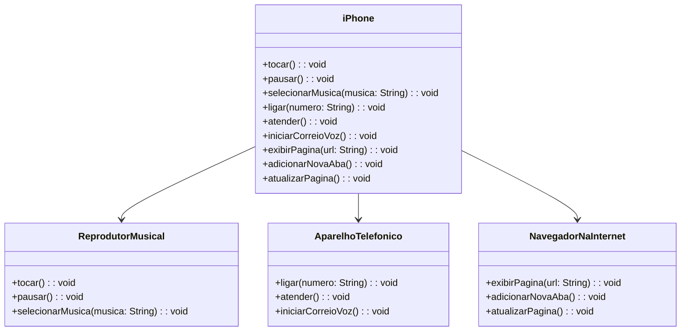

# POO-desafio-iphone

```mermaid
classDiagram
    class iPhone {
        +tocar(): void
        +pausar(): void
        +selecionarMusica(musica: String): void
        +ligar(numero: String): void
        +atender(): void
        +iniciarCorreioVoz(): void
        +exibirPagina(url: String): void
        +adicionarNovaAba(): void
        +atualizarPagina(): void
    }

    class ReprodutorMusical {
        +tocar(): void
        +pausar(): void
        +selecionarMusica(musica: String): void
    }

    class AparelhoTelefonico {
        +ligar(numero: String): void
        +atender(): void
        +iniciarCorreioVoz(): void
    }

    class NavegadorNaInternet {
        +exibirPagina(url: String): void
        +adicionarNovaAba(): void
        +atualizarPagina(): void
    }

    iPhone --> ReprodutorMusical
    iPhone --> AparelhoTelefonico
    iPhone --> NavegadorNaInternet

```
